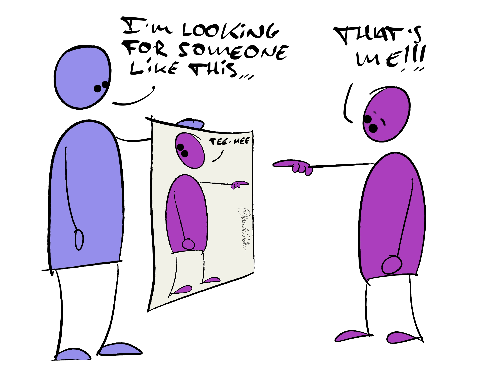

>[[🏋️ Trainings|Trainings]] >> [[👨‍🎓 Mini-training - Introduction to Stages & Ingredients of Business Growth (SIBG) Pt. 0.0|Stages and Ingredients of Business Growth]] >> 1.1 - How to define your Customer Avatar

One of the biggest mistakes you can make when marketing or selling your work, is thinking that it's for "everyone who has problem X".

Not everyone who has a problem you can solve is also a ready, and qualified, candidate.

That's why it's extremely important to figure out - with precision and certainty - which buyer is, and is not qualified.

This way, you get to direct your attention, energy, and investment, toward the most likely candidates.

Put differently: when you have a well-defined customer avatar, you can operate with efficiency.

And, bonus: you won't be excluding anyone - it's just that you seek to appeal to specifically the ideal kind of buyer.

You aim narrow, but accept wide: if your ideal buyer is a UX consultant, but a leadership coach shows up asking for your help, there's no rule that says you should turn them away if they otherwise qualify in terms of need, urgency, and budget.

So let's walk through some basic steps required to develop a customer avatar:

### Step 1: Develop a best-guess definition of who your ideal buyer would be

We're looking for a placeholder definition, a theory that you can verify.

That definition consists of three components, and as always, they're based on questions.

**1. Values**

Looking for people with shared values is a great way to always have rapport with people, so:

Which values do you want your buyer to have in common with you?

**2. [[📄 What's their problem-stack?|Problem-stack]]**   ^13eb3f

Most likely, your work can solve dozens of different kinds of problems.

But to have an avatar you can target, you need to choose a small set (or: stack) of problems, and look for people who want to solve one or more of them.

These problems need to be:

- Costly to keep, and:
- Urgently in need of a solution

So your question is:

Which three related problems, obstacles or frustrations does your ideal buyer have - [[📄 What's their problem-stack?|what's their problem-stack?]]

**3. Aspirational identity**

"People don't buy products - they buy a different version of themselves".

~ Steve Jobs ^00f238

Each time someone buys something, it causes a change in self-identity.

So, you need to ask yourself:

Who is my buyer looking to become?

### Step 2: Do research, and validate your theory

Schedule calls, interview people, and ask them about their problems.

In other words, you'll need to do customer research, and figure out whether you've got the items in step 1 defined correctly.

25 interviews should be enough to get an idea, but you might equally need fewer, or more.

The questions you want to ask people should address the following:

- Is this a problem you have?
- How much does it hurt, or cost you, to keep the problem?
- What would be a reason to not solve this problem, or not now?
- What promise should I make, for you to want a solution?

### Step 3: Consolidate, formalise, and target

Review your results, adjust your theory, and write up a bio for your ideal buyer.

This bio will be your icon, your signpost, your North Star.

Each time you plan an action, strategy, tactic or project, you can ask yourself:

Will this increase my chances of becoming visible and appealing to this particular type of  individual?

That way, you're working with a razor:

A criterium that prevents you from going too broad and wasting energy, focusing instead all your energy on those buyers most likely to purchase.

Next up, **[[👨‍🎓 SIBG Pt. 1.2 - How to define your value proposition, aka USP|Part 1.2: 🧑‍🎓 How to develop and identify your USP, because: why you...?]]**

 

