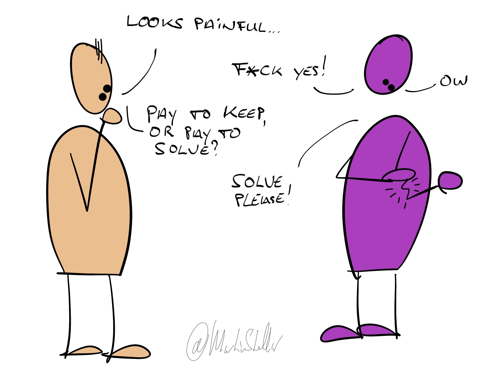

The thing about problems is that you'll pay for them, whether you want to or not.

You either pay for keeping a problem, or you pay for solving it.

Your buyer also has a problem that they're going to pay for.

They too will either pay for getting rid of the problem... or for keeping it.

What you pay for keeping a problem is what I call 'problem-cost'.

And when a buyer has needs and wants but no urgency, that's when deals stall and you get ghosted.

That's why you need to get your buyer clarity, on [[📄 What's their problem-stack?|the size and cost of the problem they have]] - the problem that you can solve - and how much it would cost them to keep it.

> You have this problem, and it's costing you this much
>
> I can solve that for you, for $XYZ
>
> The question I'd like to leave you with, is:
>
> Considering that cost, and the cost of the solution...
>
> Is it worth keeping the problem?
>
> Can you afford to keep paying for it?

This way your deals will close faster, and bad leads will disqualify themselves faster.

And to create that clarity on problem-cost that your buyer needs, you need to go beyond the obvious and the directly measurable.

Sure, a problem like "HR keeps hiring the wrong people and 12,35% of new hires leave in less than 3 months" shows up very nicely in a spreadsheet, and is measurable, and has a financial ramification.

But that's not enough to create a sale. Your buyer knows the number, and its financial cost, and you hammering on that as the reason to buy your staffing services only turns you into a nag.

Instead, you want to include more, often unseen or un-considered elements, with questions like:

"What other problems go along with that one?"

"How much does this affect you (or your team) in terms of calm, control and effectiveness?"

"Do you often find yourself bothered by this problem, outside of work? Keep you up at night at all?"

"Does this problem affect your status among your peers?"

"Or how you're perceived in the marketplace?"

"What project can't start, or be completed, until this problem gets solved?"

When you get a buyer to think about questions like these, you're doing them a massive favour.

You'll be causing them to see the problem not just in isolation, but as part of a larger whole, with all the ramifications and consequences included in the picture.

And that will make it super easy for them to decide.

They will either decide:

"The problem is too big, [[📄 Sell a remedy, not a pain-killer|where do I sign?]]" or:

"If that's the size of the problem and the cost of solving it, I'll keep paying for the problem."

Either way, you'll have done them a service - and you'll likely have landed a sale.

And if not, you'll have lost a sale and eliminated a deal from your pipeline that wasn't worthy of your time. You win either way.