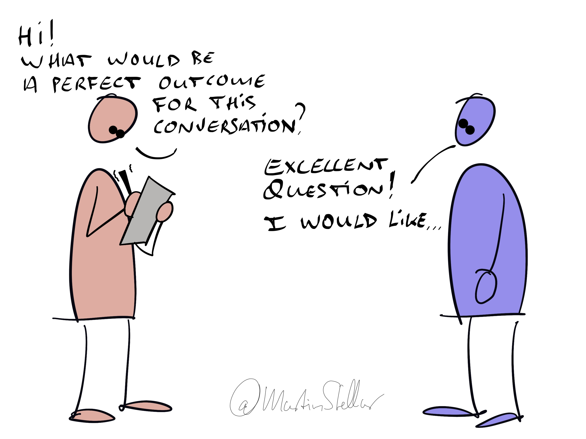

When you’re starting a sales conversation with a buyer, one of the most important and powerful things to do - right at the start - is set an agenda you both agree on.

If you don’t, it’s going to be really hard to get to a good, satisfying conclusion to the talk.

After all: if you don’t have a well-defined end-point, how are you going to make sure you reach one?

How will you make sure the meeting was worth your time, and that of your buyer, and moved the process and the sale forward, if there's no shared goal to work towards?

That's why you want to set an agenda and a goal at the start, and there’s two basic ways to do it, depending on the context and background of the meeting.

The first is when it’s clearly understood that this is a sales conversation, and we’re here to figure out whether or not it’s the right choice for the other person to buy.

In which case, that then is something you can say straight out:

“So before we get started, just to set the stage: We’re here to talk about your challenges, and whether or not our solution is the right choice for you. Does that sound right?”

If the buyer agrees, then you have a shared, agreed-upon agenda, and you both know what you’re working towards. You effectively have [[📄 Why you need permission in sales and with people, and how to get it at four different levels|permission]] to have a sales conversation.

If they don't agree, it'll be because something didn't 'sound right', and they'll likely proceed to tell what *is* their goal with that meeting.

And that means you gain intel on where they are at in their buying process, and you'll be able to avoid making an offer or pitching your work to someone who isn't ready for that, or to update your value proposition based on what they say, before you make the offer.

The other situation is when someone books an intro call, strategy session, exploration or discovery call, demo, or anything similar.

That’s not a meeting where you get to sell: it's one where you get to discover and investigate, diagnose and explore.

For that type of initial exploratory conversation, a really good opener is:

“Before we get started, can you tell me what would be an ideal outcome for you, in this conversation?”

When you do that, you take the pressure off - you remove the buyer's inherent concern that you might try and sell them on something. 

And, you give the buyer autonomy: you’re letting them decide what they want to focus on.

And because they’re there knowing that you’re a provider and you’re open for business, in most cases they’ll say something that indicates that they might be interested in buying, that you can then explore in more detail with them.

Of course there are many different openers, and you need to find your own 'languaging', but never forget:

If you're here to serve your buyer, then that process of serving starts when your conversation starts.

And the best way to serve, is to define an outcome, agree on it, and work towards it.

In other words: business conversations, step 1:

Set an agenda, define the ideal outcome.

If the above makes sense, but you struggle find the people to have those conversations with, maybe check out *MYNO*:

It's a mix of training and workflow, to help you *[[⛏️ MYNO = Mine Your Network for Opportunities|Mine Your Network for Opportunities]]*
