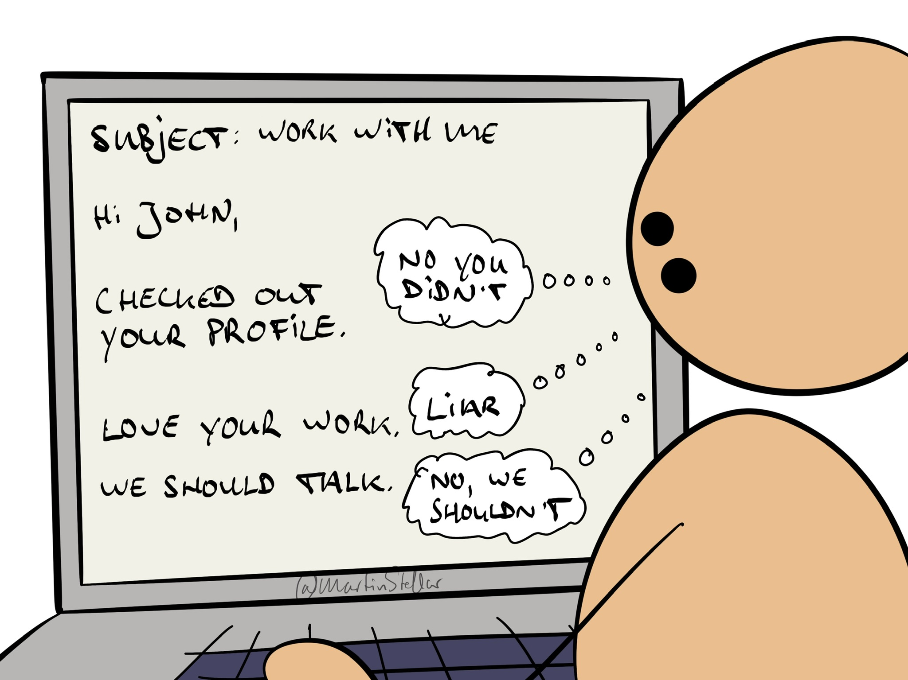

---
tags:
  - Articles
  - SalesConversations
  - LeadGeneration
  - Integrity
  - Ethics
  - EthicalSelling
pubDate: 2024-02-21
type: sfcContent
cdate: 2023-08-17 Thu
---

Okay I get it: the promise of automating or outsourcing lead generation is mighty tempting.

Most coaches and consultants tell me that once they're in front of a buyer, they're quite capable of selling their work - but it's just that finding the right person and figuring out how to get in front of them... well that's just such a tough job, isn't it? Can we not just outsource that, hand it over to specialists, let an AI help us?

Again: probably best not. For instance:

A client replied to [[📄 Why lead generation on autopilot is possibly the worst thing you could do for your business|that article]] and told me that his company tried outsourcing its lead gen, some time ago, and spent "a lot of money" on "crap".

Now that's bad by itself - but, money can be replaced.

What you can not replace - or in this case: repair - is the damage done to integrity and ethics and reputation.

Because this client told me that the agency would send messages that said things like "I was impressed by your profile" and "You have an awesome product"... but it was all lies, because my client never saw the recipient's profile or product.

So yeah, sure you can scale up your lead gen by outsourcing it or putting it on autopilot... but if it means that you have let others or a machine lie... in your name? Really?

My client said they quit the experiment, because "We're not going to lie at scale".

And that right there, is what sets apart not only those with a moral compass from those with lacking or absent ethics:

It also separates the fools from the smart.

Because[[📄 How to Lead With Values and Create Rapport With Buyers| being true to your values]], keeping your integrity intact... *leading* with values, is a far more effective, and far more profitable, thing to do.

For one thing, when values are the thing that steer you, people with similar values will recognise that and be more interested in engaging with you, while those with conflicting values will be more likely to turn away.

That's pipeline efficiency right there, because:

When two people share similar values, there's rapport built into the relationship, right from the start, even before your first meeting.

And not only that: When both your work, AND your lead-gen and sales process are built on values, you'll end up building a customer-base of similar people who all share values with you and one another.

And that means that you can create connections between them with ease, and once you start doing that you'll notice that people return the favour and connect you to people in their world, and suddenly you're getting referrals.

And, you're getting referrals to people who are pre-disposed to engaging with you and buying from you, because not only is your work up to a high standard, so is the entirety of all your business-dealings, including your sales process and the way your values shine through all of it.

Fairly nice, no? You get more business by leaning on your values, or what I call: "[[📄 Why values are not a hippy thing and why they're crucial in selling|Selling more *because* of your values]], not *despite* them".

So just by making sure you know what your values are and by committing to making them the lead in your customer interactions, you get to do the right thing, and your business grows because of it. Woot.

Anyway, I'm probably preaching to the choir here.

But should you want to get help in communicating with your buyers in a way that gets them on board with the conversation and your offer and the purchase: you can get my help with an SFC Personal subscription, at $99 per month.

[More information here.](https://personal.salesflowcoach.app/)