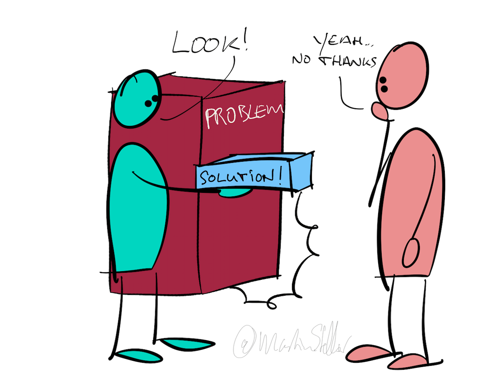

Another [[📄 Are you selling them a problem? (Pt. 1 - Interaction tax)|problem we often sell our buyers]], guaranteed to ruin a sale:

Adoption-cost.

Meaning: the amount of effort, resources or mental energy, that your buyer needs to spend, in order to get the outcome you promise they'll get when they buy.

Put differently: when a buyer picks up your offer, what expense or effort or friction do they have to deal with?

For instance, imagine you’re pitching stellar web design to someone who’s understaffed and overworked.

They really need your help, because their site is ancient, broken, and the traffic doesn't convert.

A great opportunity, of course: You get to do your website magic, and they get to finally have a site that works for them.

But, for you to do your job, they need to deliver all kinds of materials to you.

Sales copy, photos, SEO reports and keywords and bio copy... a bunch of things.

That’s a high cost for someone who's overworked and short on time - so obviously, they won't buy.

No matter how wonderful your work is and how badly they need you, the problem you're 'selling' them along with your solution, is just too big. No sale.

Another example:

I will always try and get people to buy into the idea of doing email marketing, because it’s such a powerful strategy.

But for many people, the decision to send a daily email means they need to 'buy a problem' along with the solution:

“I'll have to do it consistently and without fail and I don't want to be bound to doing that every day”.

“I’m afraid I’ll burn my list”.

“I don’t know if I’ll have enough ideas to keep going”.

So no matter how well email marketing might work, or how cleverly I pitch someone on doing it for themselves:

For some people, the cost of adoption simply is too high and they won’t buy in. I can try and reason with people when they have the above objections, but if my rule is to [[📄 Never convince, never persuade]], then I'm better of talking to people who ask "How?", instead of trying to reason with people who say "Yes, but..."

So when your deal stalls because of adoption-cost, you have three options:

1. Reduce the cost of adoption by making it less effortful to get your solution
2. Ignore the people who consider the cost too high and instead talk to those who'll accept it
3. Have a conversation with your buyer about the adoption-cost they perceive (see: [[📄 What's their problem-stack?]]), and offset it against the problem-cost. In many situations, a buyer will readily get your solution, once they realise that keeping the problem is far more costly to their business, than the cost of adopting your solution.

%%Link to: [[📄 Are you forcing people to pay interaction-tax?]]%%
