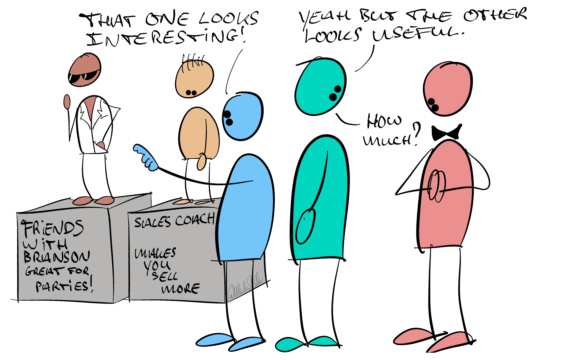

While asking questions and listening are at the heart of ethical selling, there will come a moment - several moments, more likely - where the buyer wants you to say something.

Maybe answer a question, explain something, repeat something or state your price…

Those are crucial moments.

The way you handle them determines whether or not your sales conversation will go smoothly, or instead ends up a struggle.

Most people, when it’s their time to talk, will go for ‘interesting’, which leads to statements like:

"We're the world’s largest XYZ"!

"I work with some of the most influential authors!"

"We're an award-winning agency!"

"I was talking to Richard Branson about that last week!"

Or, whatever message is thought to add weight and make the speaker seem like An Item To Take Seriously.

The problem is not that statements like these don’t make you look interesting.

The problem is that they **do**.

Here's the harsh truth:

A buyer doesn’t give a damn about how interesting you might be.

A buyer wants to know how interested you are **in them**.

And that doesn't mean 'interested in the money they might pay you'

They want to know how interested you are in understanding, and solving, their problem.

And for all you regular, not-award-winning, non-world’s-largest, not-connected-to-celebs business owners out there:

The good news is that even if you're as boring as a wet sheet of paper, you can still sell your stuff, and at good prices too.

How?

By being interested, and by being helpful[^1], and *useful*. (All of which are, incendentally, a guaranteed cure for being boring, but I digress).

It's very simple:

You demonstrate interest by asking questions, and you are helpful by having a conversation with them that gets them deeper insight into their problem, the why of it, and what to do about it.

That's helpful. It's also called a "sales conversation", of the kind that is quality, not awkward, and not pushy.

But it *is* a terrific way to [[📄 Why you need permission in sales and with people, and how to get it at four different levels|gain the permission you need in order to ask for the sale.]]

So when it’s your turn to talk, you can safely skip over all the things that make you look interesting.

Share insights, ask clarifying questions, suggest ideas or changes, and above all, and before anything else:

Make sure the buyer knows that you really *get* their situation.

Because it’s super useful to talk to someone who gets us - there’s no way we won’t get something useful out of the conversation.

And even if they don’t buy then, they’ll be happy they spoke with you, and you’ll be welcome when you reach out again.

There: an easier conversation, with better positioning.

And just because you were trying to be helpful and not try to look interesting: an open door once you follow up, as well.

Now ain't that useful.

[^1]: Just be careful you don't let being helpful [[📄 How to ruin a sale by being helpful|ruin the sale]]
