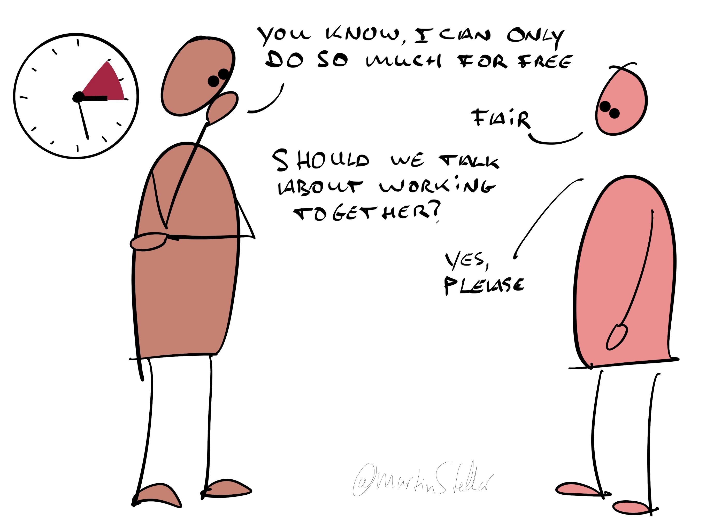

Saw an interesting tweet the other day:

>You are not in the business of subsidising your client's business.

>If they cannot afford to pay someone to solve their problems in relation to the size of the problem, it is not your problem. Problem solved.

Couldn’t have said it better.

And it's an important notion, especially for the kind of people that I tend to work with: Good people, who are in business with a mission and have values and who want to operate with integrity.

Because people like that - people like us - we very often are too generous with our time.

Very often, we don't put on our oxygen mask first, before taking care of someone else.

And so we give and we give, and we spend another hour and get on another call, and give more free consulting, an just churn away so much time, trying to get a buyer to finally say "Yes".

What, your buyer is going to endear themselves to you, and take pity, and finally be overwhelmed by the sheer amount of generosity, and reward you for the terrific person that you are buy giving you money? Well no, they won't.

In fact, exactly the opposite will happen when you give too much without a limit.

If you’re too generous with your time (remember, that’s your scarcest asset), people aren't going to take you seriously.

Because if *you* don’t value your time, it's not very likely that *they* will value your time - and then why should they pay for it? I mean... if you give it away for free...?

When you run your sales process in a sloppy manner, and you don't have any boundaries on your time, your hard work effectively means you're subsidising your buyer's business. (And because they'll end up buying from somebody else who *does* ask for the sale, you're [[📄 Stop giving money to your competitors!|handing money to your competitors]]).

How to fix this problem, and still be a nice person who isn’t salesy:

Decide for yourself how much generosity you can apply and deploy, and put a hard limit on it.

This many hours, that many meetings, whatever works for you.

And when you reach that limit, you tell your buyer:

“Say, there’s only so much I can do for free. Should we talk about working together?”

You’ll either get a “Yes”, or “Later”, or “Don’t have the money”.

And while it might sound harsh, a buyer who doesn’t have the money is in the end not your problem - but it becomes your problem if you keep trying to enroll them by giving more of your time away for free. You just can't afford to waste time on people who you [[📄 Who to ignore (do they wear a business face?)|should actually not engage with]].

Don't subsidise your buyer's business, but focus instead on the people who _are_ able to hire you, so that you can do the great work you're in business for.
