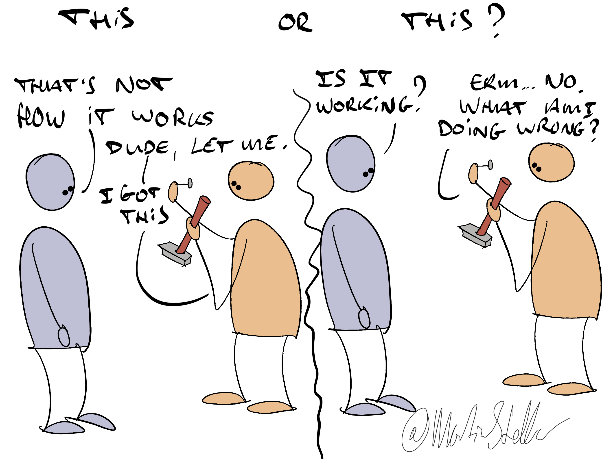

Good ideas abound, but they’re a dime a dozen.

Because unless someone accepts a good idea, it’s little use.

But each day, we volunteer our good ideas to others, and in doing so, we almost ensure they don't get picked up.

“This thing would really help you!”

“Have you tried XYZ?”

“Dude, you’re holding it wrong - that’s not how it works”.

“Darling, maybe we should stop and ask for directions?”

If you’ve ever volunteered good ideas, you’ll know how rarely they get adopted - people simply don't like it when we [[📄 Never convince, never persuade|try to convince or persuade them.]]

Why?

Because each time you suggest something, the other person subconsciously is being told that they’re wrong, which is exactly why so many good ideas get lost.

You don't make people wrong, you say? Well, that *is* what you do, when you have a good idea they need to see: you're right, and you want them to agree, so they're in the wrong.

Nobody likes to be 'made wrong'. And while our intentions may be excellent, our coming out with our good ideas unbeckoned and uninvited, just doesn’t work.

Everything changes though, when someone asks for our good ideas. That’s when they listen, consider, and often also implement.

This principle - inadvertently ‘making someone wrong’ - is why so many sales opportunities break down, just because we're not aware that in offering and suggesting something, you actually push your buyer away. You [[📄 How to ruin a sale by being helpful|ruin the sale by being helpful.]]

So how do you get your child, your spouse, your assistant - or indeed your buyer - to ask you for your good ideas?

Well, you can’t ‘get them to’. We don’t control other people.

But, we can be the best possible partner in the conversation, for them to want to know, and ask for, our good ideas.

How?

Volunteer nothing. Offer no good advice. Have no excellent recommendations for them.

Instead, learn that person. [[📄 On selling, entitlement, and service#^4dd2d4|Investigate what they’re up against]].

Ask questions and keep asking them, until they ask you: “What would you do?”

That's when they're open, interested, and receptive.

As I've said before: Ask people about their problems, until they ask about your solution.

When they do, that's when you offer your idea, and then you’ll very likely see it heard, considered, and probably even adopted.

But until they ask?

Volunteer nothing.

Not only is it respectful to leave the other to ask, instead of taking the high-ground and that comes with 'knowing what’s best for others', it’s also vastly more effective.
