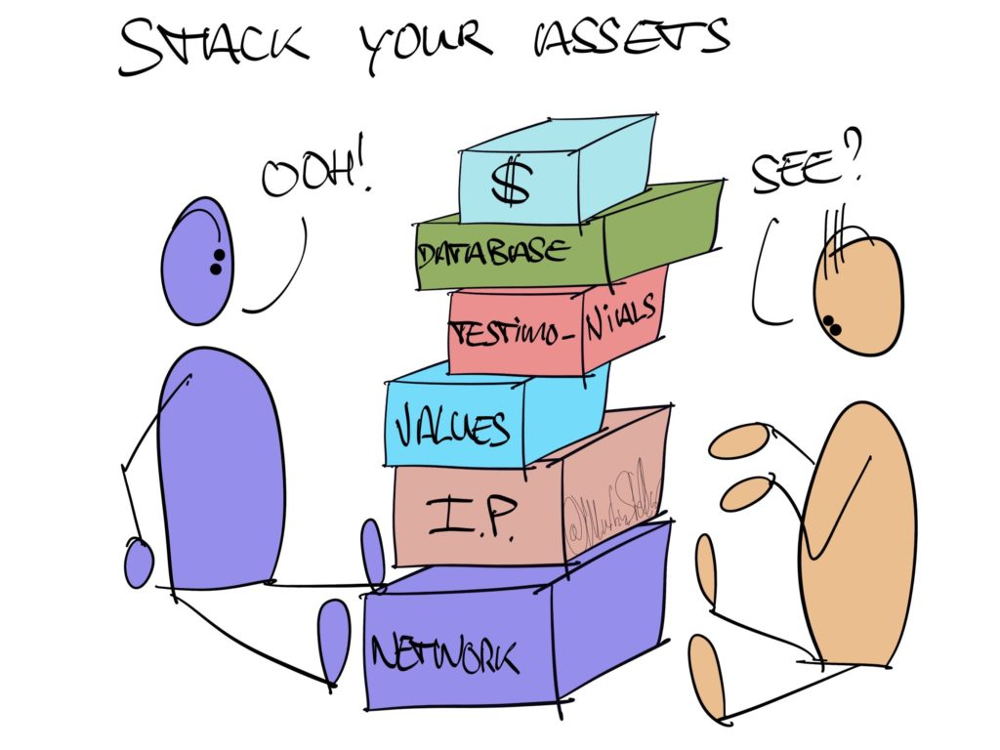
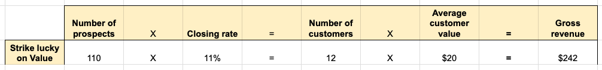

---
tags:
  - Articles
  - Revenue
  - Metrics
pubDate: 2024-04-03
type: sfcContent
location: Granada
cdate: 2024-03-25 Mon
title: "📄 Hidden Sales Levers: How to grow your revenue by 33% or more without spending any extra time or money"

---
i

 
Let's talk revenue growth, and let's look at some of the assets and levers that exist in your sales process today, and that you can use to your advantage at no extra cost, once you understand them and know how to use them.

Or, what I call: the Hidden Sales Levers that every business has, but that most businesses under-utilise. Once again, let's look at how to 'stack your assets'.

Let's say that on any given day, you make an annual average of $1000 in gross revenue.

And let's say your aim was to raise that revenue by 10% - do you think that would be attainable?  

if you were to get specific and precise and discerning, about which buyers you interact with, and how you engage with them, do you think you could get 10% more people to say "Yes, let's do it"?

For most businesses, that could be achieved by simply increasing focus and precision in the sales process, which includes ignoring dud deals.

So let's say you achieve that, and you get your conversion rate up by 10%. That's nice, but what if you have bigger ambitions for growth?

Well, then you can also try and increase the average amount of money buyers pay you.

Maybe you could raise your prices 10%, and justify that by adding in a bonus? Or maybe you can cross-sell, and add in a product from another business that complements your offer? Or perhaps you could offer a subscription service at 10% the normal purchase price, and your buyer pays for that in monthly instalments?

Great. Your Average Customer Value is now 10% higher, and so is your revenue.

But, there's more: you can also try and increase the number of qualified leads by 10%. That too should get you 10% revenue growth.

No, the real fun begins when you put those three together.

Because 10% growth is 10% growth – that’s nice, but I was talking about 33%.

Besides 10% growth is nice but how much of a difference does that really make, for your business, if you raise your bottom-line by 10%?

The difference is made when you work three numbers at the same time.

So let’s do that. Let's say you have 100 leads, at a conversion rate of 10%, and an average customer value of $10:

See the math working? If you increase the three core metrics by 10% each, you get a total of 33% revenue growth.

But it gets better, because it gets even more fun when you strike lucky, and you happen to raise one of them by more than 10%. Say you are able to increase your leads by 10%, and your conversion rate as well... and your average customer value goes up not by 10%, but 20%?

Well, then the numbers look like this:

Looks fun, doesn't it? 10% increase here, 10% there, and 20 % elsewhere? Boom. Now you've raised your revenue by 142%.

This is the power of making sure you focus on the three most important metrics.

Now, the question is: How?

What should you do, to increase these three numbers?

Well obviously, by reading everything in [SalesFlow Coach](https://salesflowcoach.app/tags/articles)

But also, by paying close attention to the articles I'll be sending over the next few days, because I'll be sharing a ton of useful and valuable insights and strategies, to help you get those metrics, and your revenue, up.

Stay tuned for a mini-training on how to identify, and deploy the Hidden Sales Levers currently present in your business...
