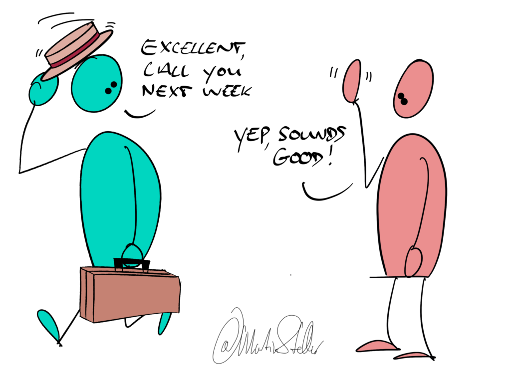

What do you do when it looks like a sale is going to close, your buyer says yes, you send the contract... and then nothing?

Of course you follow up, right?

Actually, the more of a good egg you are, the bigger the chance that you don't follow up, and wait for the next opportunity, because hey, they know you're here and you'll be the last person in the world to be a nag.

I get that. It used to be the same for me. When an opportunity broke down, I would just move on.

But if you do that, you're leaving money on the table, because yes, the fortune is in the followup.

And sure, then you get the gurus telling you that you must follow up because it’s your moral and ethical duty to make sure that the right buyer gets his stuff from you and not from someone else - but fat lot of good that does.

Knowing that it's your duty or that following up can be an act of service, doesn’t make it any easier to do it - especially if you're a person who sticks to their values, and you treat people with respect, and you don't want to be a nuisance.

So then, how do ethical people do sales and followup?

What made the difference for me is simple, and it could work for you as well:

You make followup easy by improving your buyer's experience *before* the followup.

In other words:

Make every buyer interaction a moment of joy, [[📄 On selling, entitlement, and service|service]], and [[📄 Wanting Something from People VS Wanting Something for People|helpfulness]].

Have fun talking to your customers, serve them, be yourself, be light.

You’re not there to be all dry and professional - or indeed, salesy - because who wants to talk to someone who shows up like that?

Instead, make the interaction about connecting, and learning that person, and figuring out what’s real and/or challenging for them. Create an enjoyable experience for the both of you.

When you do that, you leave people with a feeling of "Yeah, I feel respected by you. This was nice, helpful, fun. I’ll talk to you again".

Do you see where I’m going?

When you have conversations people enjoy, they’ll be open to hearing from you again.

They'll welcome you following up - they'll thank you, even.

Once I got this, following up with folk became as natural as calling up a friend.

So the question isn't "[[📄 Two Questions You Can Ask When a Buyer Ghosts You|how do I follow up?]]", but:

"How do I engage with people in such a way, make buyer interactions so enjoyable that a buyer will be looking forward to connecting again?"
