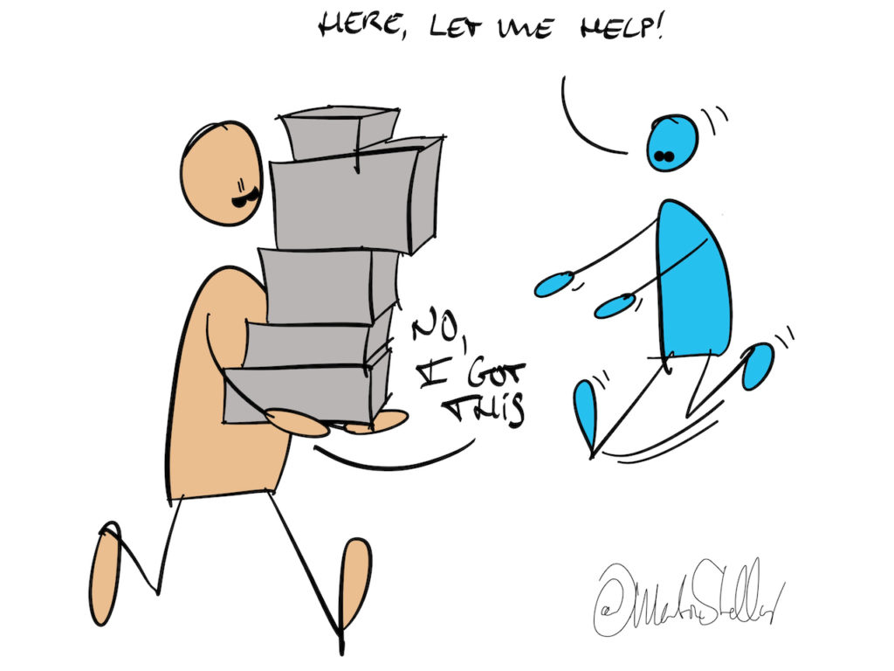

The more someone else struggles or suffers, the more we feel it, and the more we want to help them, make things right for them.

But more often than not, we get exactly the opposite result… and it’s only down to us trying too hard.

People don't like being told what to do, we want to make our own decisions, feel autonomous.

Coming at people with help or good ideas unbeckoned gets you nowhere, and might even be [[📄 How to ruin a sale by being helpful|detrimental]].

For example, you might know that I’m a big fan of meditation. It’s a wonderful thing, I’ve done it for 30 years, it’s done me tons of good, has scientific backup as to positive effects…

And yet, you'll never see me make a case for meditation - not until someone asks me.

Because if I were to try and persuade someone to try it, it would mean ‘trying hard’ - and the problem is that today someone might be swayed by my recommendation, and try it, but because the choice was made because of my clever pitch and not because of their own inner pull, they'll likely find it a disheartening experience and give up.

And then they might consider themselves ‘not fit for meditation’ or vice versa, and never get back to it, and that's the opposite of what I want.

By trying too hard, I would risk putting someone off their own course. Much better to help those who **want** change, or meditation, or growth or whatever, and who want to work on it now, and engage with **them** about it.

Self-motivated, self-inspired: It’s the best way for anyone to step into change, and the best way to help with that, is by helping the other find their own solution, and not imposing our own good ideas on anyone.

Now, back to the opening lines: the more we care about someone, and the more we hurt seeing their struggle, the more important it is to give the other space for wanting change or help, instead of proffering our help and suggestions before that person is ready.

It goes completely against our instincts, because we know, our mind convinces us, that we can help, that there’s a solution, that if only they’d listen…

But the mind will have to suck it up, because the more we try, the more wrong the mind is in its conviction that its job would be to convince the other person. (Also see: [[📄 Never convince, never persuade]])

Go ahead and try, helping someone who isn’t ready yet… has it ever worked?

Most likely, you ran into resistance and objections, and the other person’s process didn’t speed up, no matter how hard you tried.

Could even be that things stalled or slowed down. Or maybe the conversation got difficult...

Or maybe you've been on the other side, where someone just wouldn't stop trying to fix things for you, and didn't give you space to even think?

Their efforts didn't exactly help you, right?

All because of 'trying too hard'.

Pay attention to the inner feelings of compassion and pity and helpfulness, at seeing another person’s struggle, and when you notice them: check yourself.

You might just be on the verge of giving the person the very opposite of what you want for them. If your compassion drives you to 'go and help them', it's very possible that you won't help at all.

Be available, ready, present, but be careful not to hamper the other’s process by [[📄 Good ideas? Volunteer nothing|inadvertently getting in the way]].

If you really want to help, create a space and a conversation that enables the other person to seek and find their own inner pull, and avoid trying too hard to help.

And yes, that applies to sales as well - the more you try to be helpful and convince the other person how much you could help them, the more you'll trigger psychological reactance, and you'll get the opposite of what you want.

But if you help you buyer make up their own mind and make their own decision, you get the buyer, and they get the help you want them to have.
