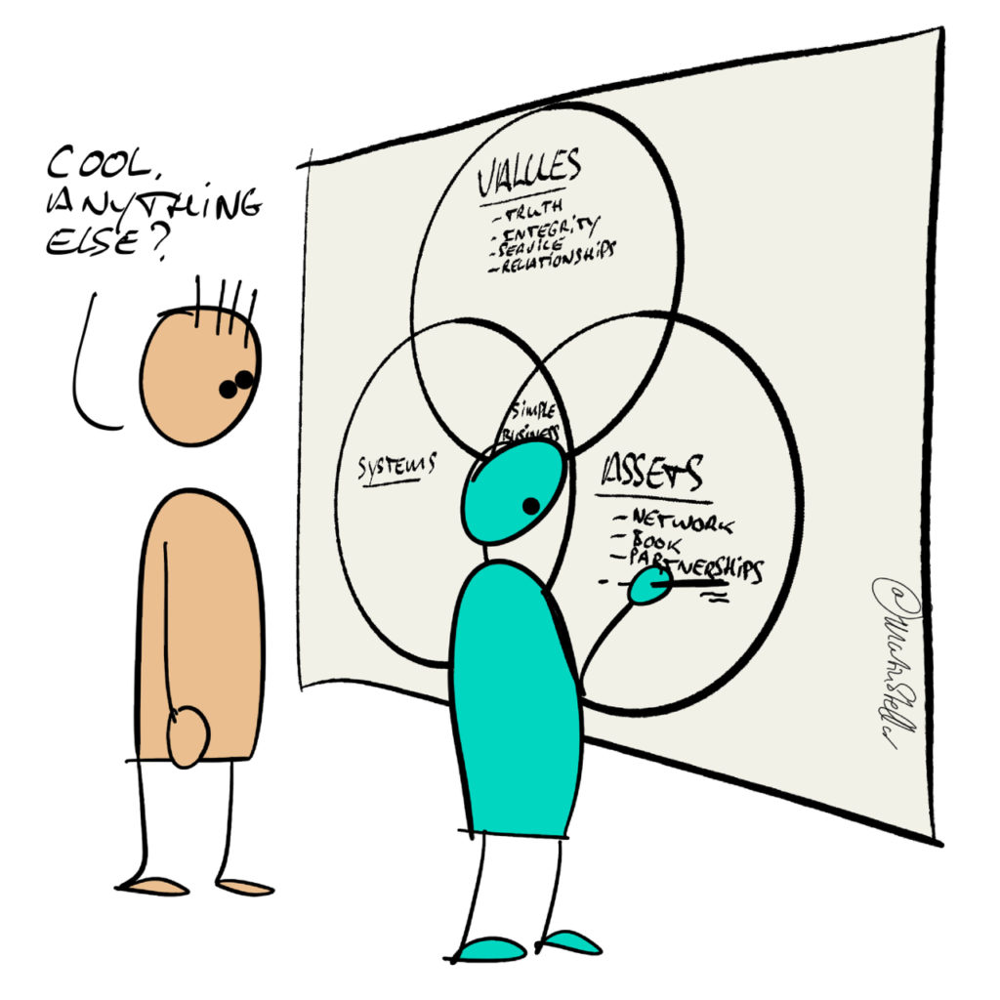

Building or running a business can be hard, but it gets easier if you avoid complexity.

Simple is good. Especially when you're starting out, or introducing a new product, or you're pivoting. (Also see: [[👨‍🎓 Mini-training - Introduction to Stages & Ingredients of Business Growth (SIBG) Pt. 0.0|🧑‍🎓 Stages & Ingredients of Business Growth - Mini-training]])

The fewer moving parts in anything, the easier it is to run the thing, test it, find flaws or bottlenecks, and fix & optimise, and that applies to business, marketing, and sales as it does to anything.

You can make your business as complicated as you like, with teams, advertisements, funnels, infrastructure, franchises - you name it. A world of options.

But the more you add in, the more complex it gets and the harder it gets to figure out what’s broken and needs fixing, or what works and merits more resources.

So to help you keep things simple, I came up with a model called VASO: Values, Assets, Systems, and Outcomes.

It's a handy lens for helping you reflect, prioritise, and strategise, because it aligns your thinking around some of the most fundamental elements of a well-functioning business.

**1: Values**

These inform your purpose and your mission.

And, they enable you to identify and find people who share your values, so that you’ll have rapport with them right off the bat.

And anything or anyone or any plan or strategy or tactic, that's not aligned with your values?

Out with it.

Very simple. Less to fret over.

**2: Assets**

These can be tangible, like a list of names, hardware, office space - or intangible, such as your network, your skillset, your intellectual capital, your footprint and visibility, or the amount of goodwill and buy-in your audience has for you.

And of course, the single most valuable asset in any business: Your list of past & present clients  - The people who trusted you so much that they gave you money, meaning they're the most likely money to buy something from you again.

But there's more assets to leverage, and nearly everyone ignores the big one: the owner's IP, and the leverage you can get from publishing all that intellectual capital. (Because [[📄 Every business is a publishing business]])

**3: Systems**

This is where you tie the first two steps together, by letting your values determine which assets to leverage and how.

So you build structures, frameworks, Standard Operating Procedures, workflows, documentation, and so on.

You automate stuff so that you get to spend more time as the architect of your business, instead of the operator in your business.

And, you add metrics, points of measurement, so that you’ll know what works and what doesn’t, all so that you have a machine that you can operate, with dials and readouts.

**4: Outcomes**

It's crucial to have clearly defined outcomes, goals, milestones - you need to know exactly where you're going.

Because if you don't have a clear goal, how will you know you're reaching it?

How are you going to measure how well your systems are working, if you don't have a well-defined picture of what output you want from your systems and your business?

That's the VASO model for keeping things simple, and this is how you put it to work:

Ask yourself these questions (longhand brainstorming is best, for this kind of work).

**1: What are my values?**

What would I stand on a barricade for?

What do I not accept, what change am I willing to fight for, or stake things for?

**2: What assets do I have in place?**

What tangible value does each have in my business, what economic value if applicable?

What potential does each asset have, provided I leverage it in a smart and strategic way?

Which assets are under-leveraged and need-priority treatment in deploying them?

**3: What systems are in place?**

How well are they running?

How often do things break, or require human intervention?

Why?

In what way can my systems be simplified or improved, so that they work better, or become easier to measure for output and results?

**4: What outcomes are my systems producing?**

What outcomes do I **want** my systems to produce?

What do I need to modify in my systems and strategy, to reach my clearly-defined outcomes faster?

Point is, everything is a either a system or part of one.

And every system is perfect for the outcome it produces.

So if you see outcomes you’d like to change, or things are going too slow, you now know which questions to ask, in order to do some high-level, intelligent reflection.

You look at how your values and assets can be combined and leveraged so that the system becomes simpler and more measurable, and more likely to get you the outcome you want.

Hey, and if the outcome you want is simply "More deals, more sales, more revenue", then I can coach you on each of your deals, and help you move them forward faster.

For that, there's several options: either highly involved, and admittedly costly, personal coaching, or there's [SFC Personal](https://personal.salesflowcoach.app/), where you get ongoing access to me by way of a personal coaching thread.

And, of course, there's [[Academy|SFC Academy]], where you get 12 months of access to the Personal coaching thread, plus community membership, AND a 10-week training on ethical selling. A world of options, [let me know](mailto:personal@salesflowcoach.app) which one works for you.
