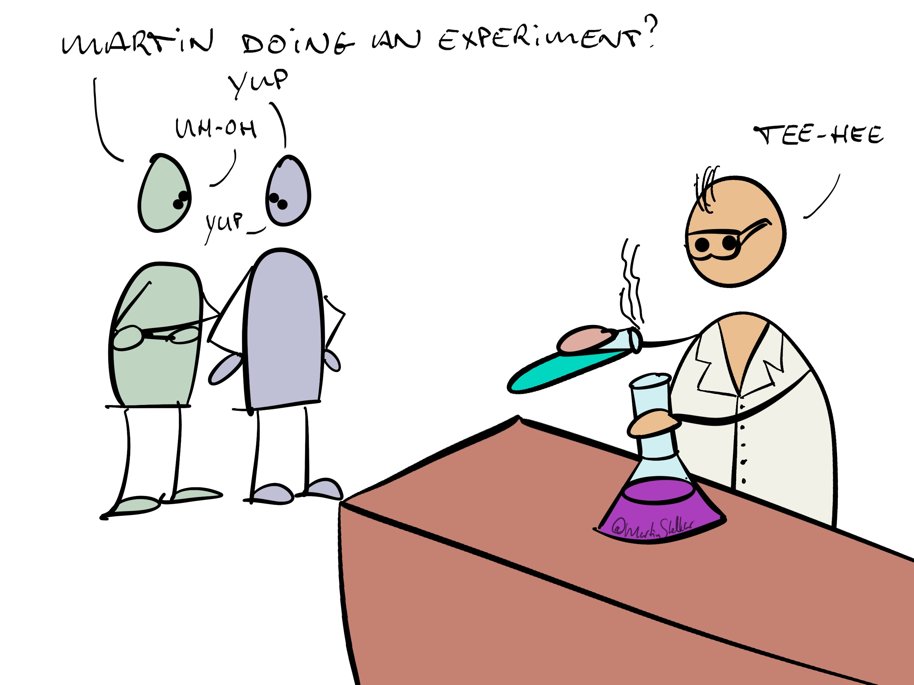

---
tags:
  - Articles
  - GrowthExperiments
  - TestingHypothesis
pubDate: 2023-11-20
type: sfcContent
cdate: 2023-11-20 Mon
---

"Hey Martin, you do realise that there's only about 4 working weeks left this year, right?"

Thus replied a friend after last Thursday's email, where I shared that I've taken on the challenge to generate $100.000 in revenue before 2024 kicks in.

And yes, you'd be forgiven for thinking I'm crazy that I can pull that off, from a standing start, with an offer I came up with just a few days ago. And if then you consider that my list is small and I have no advertising, or social media traction... it's impossible, right?

I mean, $100K is a lot of money. But, if the offer is prized at $1500, which it is, that means it'll 'only' take 67 sales. That's not a trivial number at all, but it's certainly not an *insane* number.

And here's two more reasons why this is not a crazy plan, and you can use them to your own advantage in your own business.

Sanity-check Like I said, I'm basing this challenge on [[📄 Quick question|leverage, eg. other people's audience + their endorsement.]] I might be working from a standing start, but if I can get in front of audiences, I'll instantly get a headstart.

Sanity-check It's an experiment, not a plan for success.

While my goal is a nice round number, I don't really care about that number. What I care about, is *figuring out what would make it possible.*

And that means, my challenge isn't to make $100K, but to *run an experiment.*

An experiment to figure out what's required, for 67 people to say yes to my offer before January 1st.

I have a hyphothesis, in that:

If I create *this* offer, and show it to *these* people, with *this* messaging and USP, I might be able to generate 67 sales. Now let's see what I can do to run a test, and see if it works.

Which is why I asked for that show of hands on Wednesday, to see if any of my readers would respond and add initial data to my experiment, which they did.

And that's the big lesson today:

Everything is an experiment.

Far too often, we create a plan or challenge or goal, and we approach it as if it were a roadmap for success.

But unless you're replicating the conditions of previous success closely, you're not creating a roadmap: you're running an experiment.

You don't start a new advertising campaign to generate buyers: you run ads to figure out your targeting, design, copy, and messaging, to see if you can calibrate it to the point where you know how much it costs to acquire a customer, reliably and repeatedly.

You don't start a cold-calling campaign because you're looking for buyers - instead, you do cold-calling to figure out if this type of individual or business is a buyer or not, and why, and what they need to hear in order to buy from you, and you want to figure out if you can reach and convert that kind of buyer with enough efficiency and predictability.

It's an experiment.

So, I'm not crazy - I'm just a mad scientist, running an experiment. Don't come near the lab, sometimes things blow up here.

Anyway, I'm sure you've been agonising at the thought that Martin might be crazy, so I'm sure you're glad I cleared that up.

Oh and that offer I'm talking about, how does that work? And, is it only for the audience of other people... not for you, my loyal readers?

The second question: Why yes it is for you as well, and in fact, I'd most love my readers to join the programme!

Which is why tomorrow, I'll answer the first the question: what's in the tin?

Meanwhile, remember: everything is an experiment.

Stay tuned...

Martin
