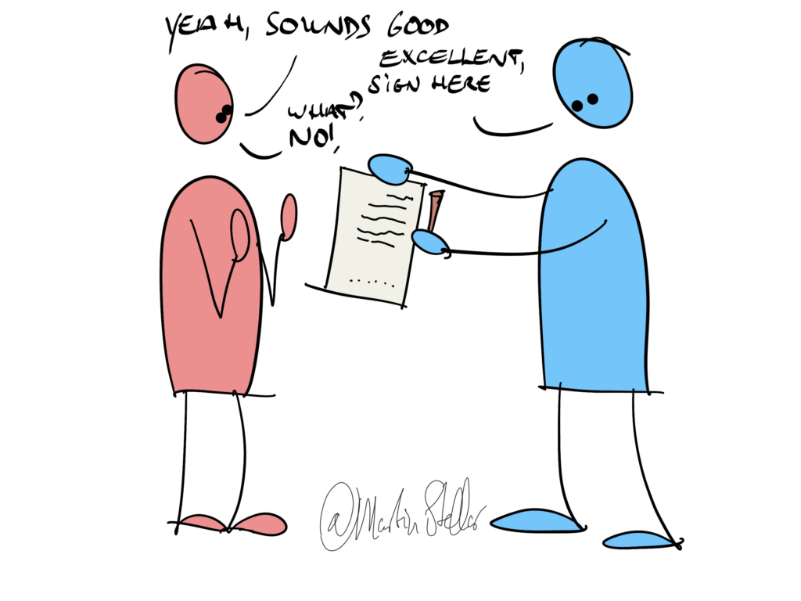

In the world of conventional sales, there's a saying that "buyers are liars".

A pretty nasty and cynical thing to say - and complete devoid of empathy (where empathy is part of the way I teach selling).

Sure, a person might say "I want it, let's do this" and then not follow through.

"I'll send the check" and then it doesn"t arrive.

"I'll be there at noon", and then they don't show up.

"This problem at my company needs solving, now", and then they stop responding to your calls and emails.

Is it because they were lying?

Probably not. People say things for a great many reasons, and who knows why they say one thing and then do something else?

They know, is who. You or I don't know what went on in their mind or their life or their business.

So it's your job - the job of the seller - to figure out why they said something that didn't end up happening.

Here's the thing:

In a selling situation, when the other says something, you need to test what they say. When a buyer tells you yes, you need to [[📄 Question the Yes, because it's not a sale unless the money is there|question the yes]], instead of assuming that saying yes means they'll be doing yes.

Not, again, because someone would be lying, but because we as humans, all of us, assume stuff.

We take things at face value.

"Yeah I like it, I want it", and we instantly assume that the deal is done.

But it ain't, not until the money is in your account or the contract has been signed.

And when you assume that thing A also literally means thing A, and that "Yes" means "It"s a sale!", you bypass that other person's reality.

Whenever you assume something about someone else - and we do it all the time - you break rapport and create a disconnect.

It'll show in your reactions, your questions, your body language, the way you structure your sentences… and that other person goes "Hey wait a minute, I never meant/said/implied that".

And… they're gone.

This is precisely why my framework for ethical selling has *Meaning* as one of its pillars, because you can't afford to take things a buyer says at face value, because:

What someone says is one thing… but what does it _mean?_

What are they really trying to say?

What did they not say?

What do they mean for you to hear?

And, is that what you *actually* heard… or did you hear what you *wanted* to hear?

What's said is one thing. [[📄 Interested vs committed - don't misread the signals|What's being heard is another]]. And what was meant is something entirely different.

Learn your buyer. Test your assumptions. Ask more questions.

Let your buyer tell you whether or not you actually heard what they said.

[[📄 How to use the L.I.V.E. model to prevent sales from breaking|Verify that you got it right]], before trying to provide your solution or offer.

That's how you avoid assumptions, and it's how you prevent against making the wrong interpretations about why something did or didn't happen.

And that is how you keep a sales conversation moving forward, instead of your buyer suddenly going ghost on you.
