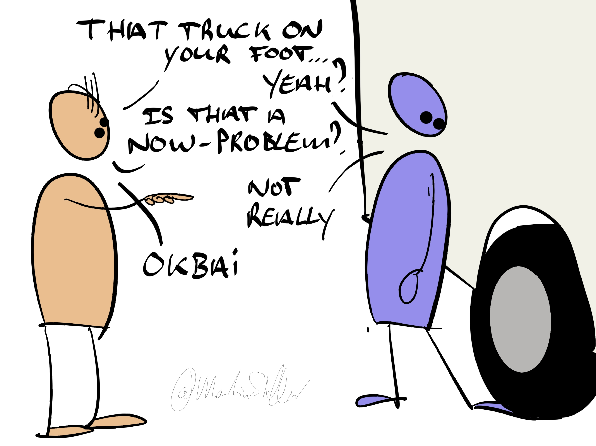

When somebody buys from you, it's because they're looking to solve a problem, right?

And, every problem has consequences, negative outcomes as a result, or what I call: [[📄 'I'll Bet That Hurts Like Mad' - How to create buyers by highlighting problem-cost|Problem-cost]].

For example: Somebody who gets a lot of traffic to their website, but nobody converts, nobody signs up for their list, nobody gets in touch, nobody buys.

That is a costly problem because getting traffic to your site requires an investment.

So if visitors don’t convert, then the problem-cost is: the low ROI on lead generation investments.

Now, the question to ask yourself, is: How fed up, *exactly*, is your buyer with [[📄 When price is your buyer's objection, give the 'put up or pay up message'|paying that cost]]?

Because the mistake sellers often make, is thinking that 'high problem-cost' means: need to solve this now.

But not everyone is ready or willing or able to solve the problem 'now'.

So if you go and engage with a buyer and they're willing to keep paying for the problem, then all you'll achieve is wasting your time and annoying your buyer.

That's why when I meet people who want my help, I ask them in the very first conversation:

"Is this a ‘now-problem’, or a ‘someday-problem?"

If their answer isn’t ‘now’, then we both know that we’re not at the point where we’ll be working together, and we can sign off and continue the conversation at a later stage.

They can go back to solving the actual now-problems they have, and I can go talk to other people, who do have a now-problem that they want me to solve, now.

So the last thing you ever want to do is spend your time with buyers who aren’t fed up with the problem, who have no urgency, who aren’t looking to solve things NOW.

Sure, there are cases where your conversation will flip them from ‘later’ to ‘now’, but in most cases, that won’t happen, and you’ll churn through your time without results.

Focus your outreach, your prospecting, your enrolment conversations on the people who would sit down and take the pebble out of their shoe, and not on the kind of people who would leave it and put a band-aid on a blister once they get home.

Put simply:

A buyer without urgency is not qualified. Save your time for those who are qualified and who do have a now-problem.

To help you figure out with your buyer how the actual urgency is, check out this article on [[📄 What's their problem-stack?|figuring out your buyer's problem-stack.]]
