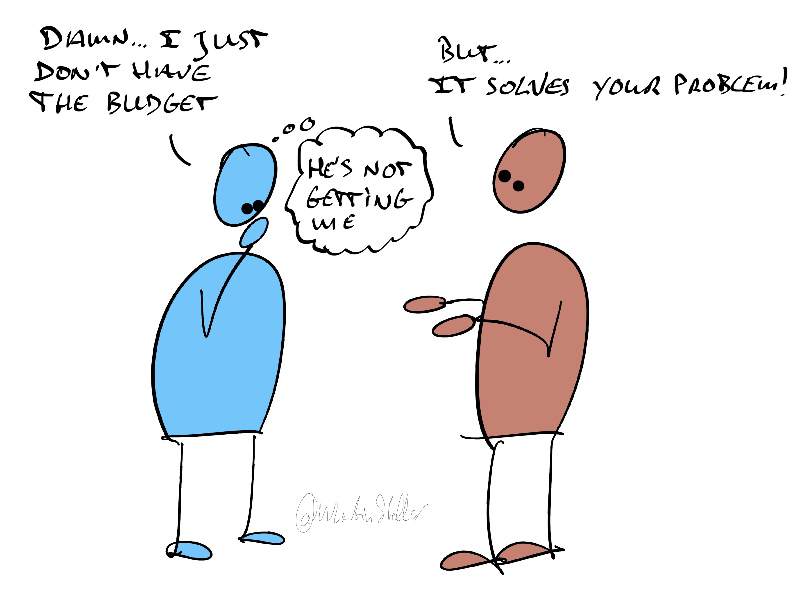

There is one word that when you are talking to a buyer, you should never use, and that’s the word "but".

Because when you talk to a buyer, and they come up with an objection, or a question or doubt or concern, and you reply saying "But...", you are making them wrong.

They didn’t get it, you’re the smart one in the room, and now you’re going to explain why they got it wrong and how to get it right.

Result: psychological reactance, and a widening distance between you and the buyer.

Simple, no? Nobody likes to be made wrong, but making the other person wrong is exactly what you do when you say "but".

For example:

Your buyer has a [[📄 What's their problem-stack?|problem]], a need, there’s urgency… (i.e. they're a [[🧑‍🎓 Sales Qualified Leads|Sales Qualified Lead]], they like what you do, they trust that you can solve their problem, and everything looks good).

But then:

“I like it, and we need this. But, it’s a lot of money and I don’t know if this is the right investment at this point.”

It's very easy to then reply with a logical statement like this:

“True, but... do you see how this purchase would solve that problem you have?”

Well yes, of course they see that.

Your buyer isn’t blind and they’re not stupid. They simply have a concern and they’re expressing it.

So instead of the above example, where you signal that they were wrong or didn’t get it, make them right:

“Absolutely true. It’s a considerable investment, and the only way you’re going to be happy doing this, is if you’re 100% behind the decision.

“If that’s not right now, then we can park the conversation here, and continue next week or next month.

“Unless you’d like to have a closer look at [[📄 Purchase motivators - Problem-cost and urgency|the cost of keeping the problem]]?”

See what’s happening there?

You’re making them right, you’re affirming their right to veto, you’re demonstrating a lack of neediness, and:

You ask a question that could well open up a line of exploration - [[📄 Purchase motivators - Problem-cost and urgency|problem-cost]] - that might actually get them to say “Yes, I’m in”, which is something you’re not likely to get if you say “But... XYZ!”.
