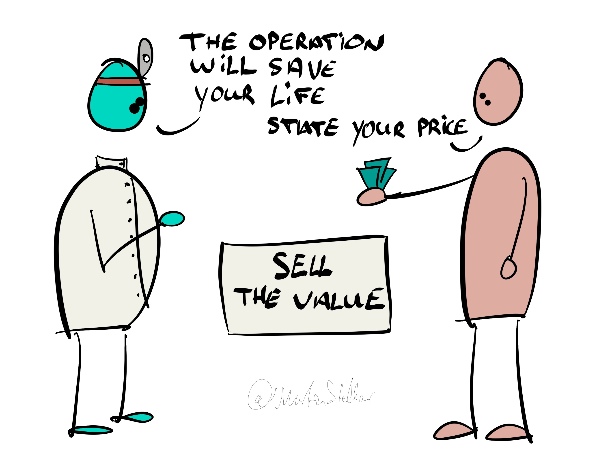

Let's talk about pricing.

Especially when it comes to high-ticket services and products, a lot of people are very conflicted about the [[📄 How to use your Effective Hourly Rate as a razor to keep you focused on the most important activities|rates that they want to charge.]]

“Because hey, I’ve done this so often, it only takes me an hour (or half a day) - how can I justify charging that high a rate for that???”

If you ever feel that way, remember this:

People buy the value of your work, not the price-point, and not the amount of time it takes you to deliver the value.

For instance:

What if I could tell you where, in this town, you can find a suitcase with a million dollars in it...?

Even if it would only take me ten seconds to tell you, would you pay me 1000 bucks for those 10 seconds? To tell you exactly where to find a suitcase full of money?

I don’t know about you, but my reply would be “Take my money!”. Obviously.

See, when somebody buys something, they're not buying your time.

They're not buying the package or the branding or even [[📄 5 Core points you have to get right if you want your business to grow#^6c027c|the promise]]:

They're buying the results, the outcome that they get. That’s the only thing they’ll want to pay for.

Now, I'm sure you don't sell the knowledge of where to find that million-dollar suitcase.

But if you coach or consult, and you're in business-to-business, and you sell something that saves time, save money, or causes your client to make more money, then that difference is the value they pay you for.

And the size and impact of that difference is the measure by which you should determine what your prices are.

So whenever you feel conflicted about charging a high fee for something that you can do in a short time, or effortlessly, remember:

It is not about the product, or the service, or the time, or the effort.

It is only, ever, exclusively, about the value of the outcome that a buyer wants to get.

That outcome justifies the price that you want to set on your work.

So ask yourself:

“How big - how valuable - is the outcome of this thing that I do, for my clients?”

Make that the basis of your pricing.
