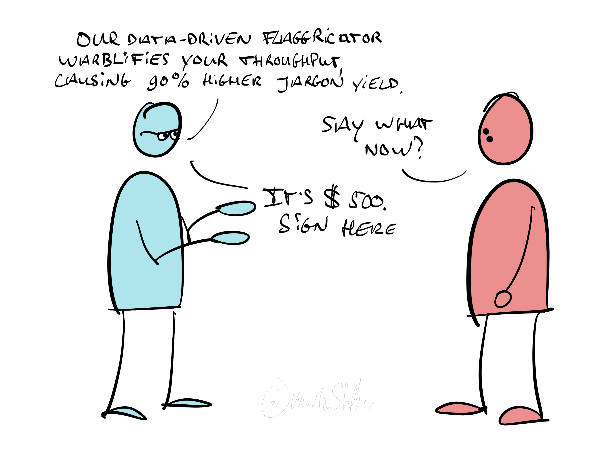

---
tags:
  - Articles
  - Messaging
  - Signals
  - Perspective-taking
cdate: 2022-12-23 Fri
pubDate: 2022-12-23
title: 📄 What are you even saying?
type: sfcContent
---

In teaching, it’s said that we should speak at the level of understanding of the student - and it’s exactly the same in sales.

Because the majority of missed opportunities in terms of converting a prospect into a buyer, can be fixed with simple messaging.

Makes no difference whether your buyer is talking to you or reading your website: you still need to make sure your point gets across

And, it makes no difference how good your offer is:

If you don’t speak your buyer’s language, there’s no sale.

Engineers and developers are an example of profiles who are especially prone to mis-messaging:

Jargon this, API that, data-driven such-and-so, and the buyer goes: “What?” or "Yes but how does it **work**?"

But not just engineers: we all tend to approach our messaging from our own point of view.

And that just doesn’t work.

Instead, you need to take _your buyer’s point of view_.

That’s why I always say:

Learn your people.

Find out why they are reading you, or talking to you.

Learn their fears & frustrations, wants and aspirations, and speak to them in the languaging that reflects those. Speak to your buyers in the terms and words that they themselves use to describe their frustrations and problems.

That’s how you get rapport, buy-in, and sales.

This is why researching your audience is so important, because that’s when you learn what words your buyers use.

And then you can _use_ those words in your messaging, and they’ll go “Huh. This person gets me”.

When you’re talking to a buyer, listen closely to how they word things, and use that same wording in your statements.

You’ll be amazed how this will transform your sales conversations.
