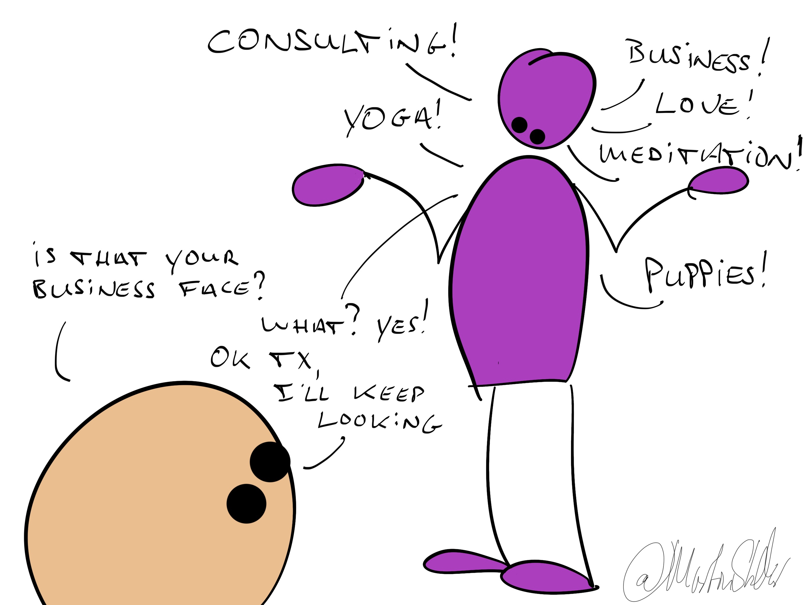

"I've sent 89 messages, but I'm not really getting a lot of replies".

A conversation with a friend who had been working hard, trying to generate sales opportunities, without seeing a lot of action as a result.

Very often when you're doing all the right things, but buyers aren't responding, it's not because your messaging is off, or your pricing or your ads or your funnel:

In most cases, it's because the *targeting* is off, in that the intended audience is way to broad, and you're including far too many people who aren't the right fit.

And it's easy to consider someone a candidate, when actually they aren't.

That's why, whether you're doing outreach or engaging with inquiries, you need to have hard rules on who you spend your time with.

In this case, my friend wanted to help authors with their business, by building websites for them.

A good niche, if you know how to play it.

But as with any niche: it's only a good niche if you know who to ignore.

For instance: a fiction writer is likely to earn less than an author who writes on business topics.

Not necessarily so, not in all cases, but plausibly and frequently

So if the goal is: 'fastest track to sales', the hard rule should be:

Ignore everyone who isn't a business author. Otherwise you just end up on calls with people who can't afford you.

Another one:

An author who wants to get into consulting might seem like a good candidate, but are they?

Because that person is much less likely to have the budget, than a consultant with a team, and who is preparing to publish a book.

Hard rule: no authors-turned-business-people, only business-people with a book.

Another hard rule - one that we should all live by if we're in B2B, regardless of your niche:

[[📄 Buyers That You Should Avoid Like the Plague|Ignore everyone]] who doesn't 'wear a business-face'.

Sure, someone whose website is friendly and welcoming might be able to invest in your work... but if they're 100% personable and barely business-minded on their website, there's a good chance that their business struggles.

Whereas someone who leads with a strong USP, precise messaging, a call-to-action and who speaks to a narrowly defined audience, is someone who gets marketing, understands business, and is therefore far more likely to be in a position to invest.

Of course you can connect or engage with the former - but the real risk is there, that you're dealing with someone whose business is a hobby or a side-hustle, in which case, again, they don't have the funds for quality work and you're just wasting time trying to win them over.

You only have so much time, you can only have a handful of meetings each day.

The more you focus on people who 'wear a business face', and ignore those who don't, the more net gain you'll get out of your outreach and your buyer-interactions.
