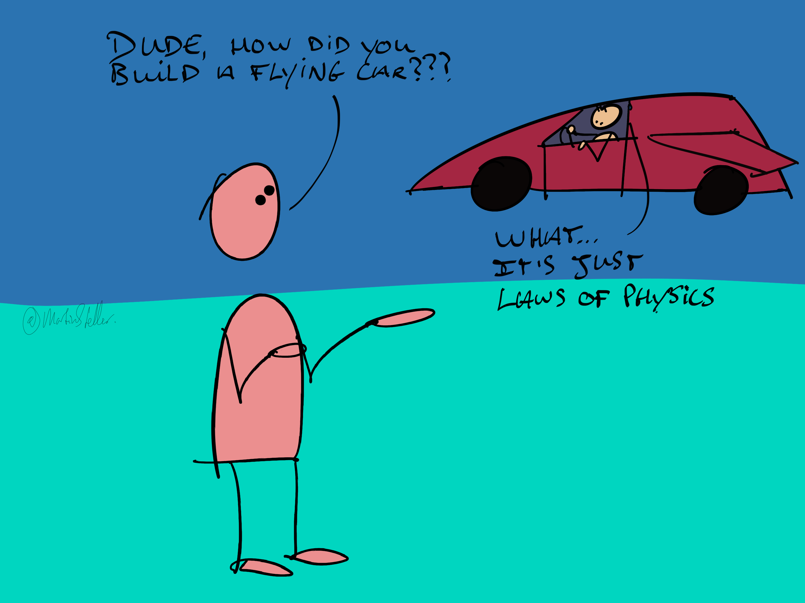

If the kind of work you do is innovative, make sure you don't let the novelty of it drive your buyer away.

It happens very easily, if you emphasise the novelty too much, or by itself.

Here's why:

When something is new, never done before, when a solution is truly next-level…

You might indeed be selling your buyer something that they really need, something that would really solve their problem, but:

When something is ‘new’, it can set off all kinds of alarm bells.

The subconscious doesn’t like new things.

Of course the emotional side of the psyche loves novelty: new is fun, exciting, promising.

But the subconscious?

It abhors things that are new.

Because [[📄 Buyer objections & the dreaded 'no' - but what if that 'no' is an invitation?#It’s the buyer's lizard brain signalling danger|we’re still ruled by our lizard brain]], neo-cortex or not.

And in prehistoric times, anything new could be a lethal threat.

An animal never seen before, or fire, or a group of different-looking cavemen cresting a hill:

Better to err on the side of caution, and consider 'new' as 'potentially dangerous'.

This is why we tend to prefer the familiar and the known, because when something is familiar or known, we know whether or not it's safe - or at least, we know more or less how unsafe it is.

So even if you’re selling something that actually is innovative, always make sure you _relate the appeal of it back to the fundamentals of safety and familiarity_.

In other words: make it plain vanilla.

For instance, a sales enablement platform could use this in their pitch:

> Yes, we use AI to truly understand what your buyers want, need, and feel - but at the heart of it, there’s nothing new about it.

> It’s just a different method to relate to people, to show that we see them, and we're trying to better understand them.

> It’s  the fundamentals of psychology and relationships, and those haven’t changed in millennia.

If you put it that way, you let your buyer know that the new aspect of your offer doesn’t represent a threat.

This matters more than you can imagine, because the slightest hint of a threat - even an imaginary threat - and your buyer will shut down.

And remember: anything new is easily assumed to hold some sort of threat or danger, by the subconscious.

So no matter how new, improved, or innovative your offer is: sell plain vanilla.
