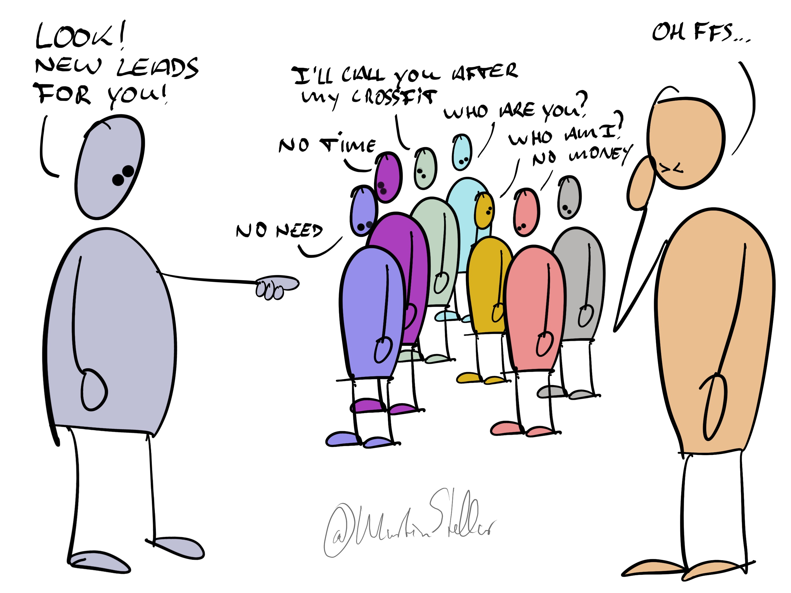

---
tags:
  - Articles
  - LeadGeneration
  - Messaging
  - Effectiveness
pubDate: 2024-02-20
type: sfcContent
cdate: 2023-08-02 Wed
---

Another day, another one of those chirpy, benefit-driven, highly persuasive messages in your inbox.

You know the kind:

"Our completely automated lead generation system can get you as many meetings as you like, with qualified buyers!"

It can be tempting to think that a service like that can fix your business-woes.

After all, generating leads and getting meetings is both a prerequisite for creating buyers, as well as one of the hardest things to do and get right.

So if they then also promise that you don't have to pay unless they get you results... well, that sounds like a great deal, doesn't it.

Well no, and for many reasons.

For starters, when lead generation runs on auto-pilot, it means the provider uses large lists of names, scraped from the web, and filtered by some broad criteria, like company size, industry, geography... but there's no further precision.

So the meetings that your provider will get you will be a mixed bag - there might be qualified leads, but there will also be duds, and probably lots of them.

And then it's on you to spend your precious and non-renewable time having meetings, only to find out that once again, this person is totally unqualified and has no real pressing issue that they need you to solve.

And that's what you get on a good day. On a bad day, you'll have meetings with clueless idiots who have no idea why they're even in a meeting with you and who probably shouldn't even be in business. That's another hour of your life, gone to never be seen again.

So your friendly web-scraping auto-pilot appointment-setting lead generator service, effectively cannibalises your time by giving you dud calls, while they earn money for bringing you crappy leads.

Another reason why lead-gen on autopilot is such a bad idea: who the hell wants to be in somebody's automated funnel? I sure don't - I resent being just a number in somebody's move-the-buyer-through-the-stages automated sales process, and receiving sequences of pseudo-personal messages supposed to entice and convince me but effectively just being a nothing more than calibrated nagging. And don't want that experience for myself, and I sure don't want to put my leads through that kind of experience either.

And finally, the big reason why you should generate your own leads:

All those autopilot lead-generation services rely on outdated, old-school principles:

Strong pitch, lead with benefits, drop names, impress and wow, because "Hey, if we're this awesome, you'd be a fool to not book a meeting with us!"

The problem isn't that those things don't work - it's that they do.

Because when someone books a call with you because they're so impressed, you end up with a fundamental, frustrating, and possibly even devastating problem:

Those leads were persuaded instead of driven by their own urge to connect with you. (Also see: [[📄 Never convince, never persuade]]. And that means turning those leads into buyers will require you to use force:

Many followups, writing proposals, many meetings, figuring out how to overcome objections, presenting demos... it's such a constant uphill battle, and it comes with a lot of churn and getting ghosted.

In other words: Everything about automated lead-gen will force you into the role of a low-level sales person.

But if you're founder or coach or consultant, I imagine you got into business to have fun solving problems for people.

So then why the hell would you pay some 25 y/o kid who discovered web scraping and AI-generated copywriting, to cannibalise your time and turn you into a simile of an underperforming sales rep?

You wouldn't. Instead, you're much better off learning how to - with precision - identify a qualified buyer from a distance, and how to message or call them in such a way that not only do you not get ghosted or ignored, you actually get "Hey thanks for the outreach - we actually have this problem. Can we talk?"
