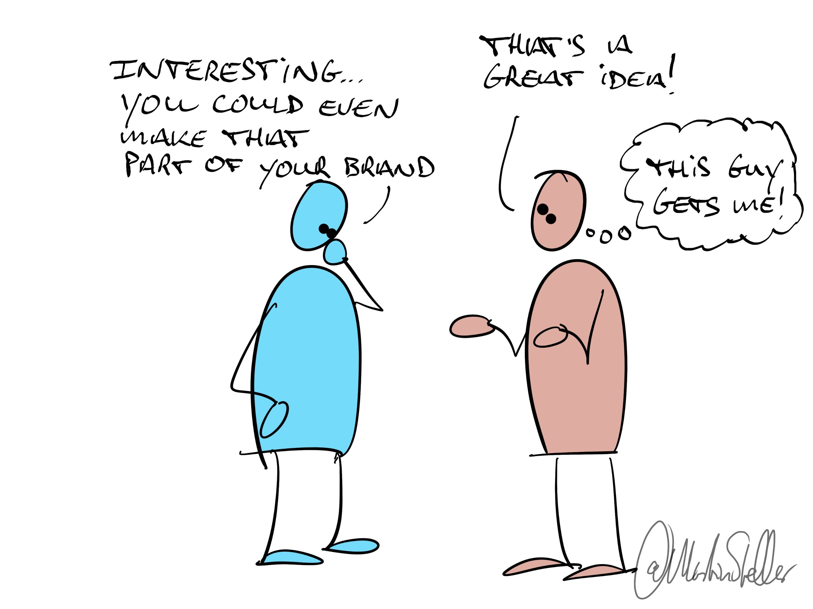

---
tags:
  - Articles
  - SalesForNicePeople
pubDate: 2024-02-13
type: sfcContent
location: 
cdate: 2024-02-13 Tue
---

What's the most impactful, worthwhile, fulfilling and uplifting experience that you can have with another person?

Think about it for a moment:

What kind of interaction gets you the biggest, most rewarding and meaningful 'payout'?

You likely have a number of options: great conversations, laughter, sports, seeing art or a show or a film... maybe hugs fit the bill, or perhaps travel or working together or cooking together...

What do all of these experiences have in common?

They all get better **when the other person truly gets us**.

The more someone else is in tune with who we are, what we think and how we feel, the more rewarding and addictive that person's presence becomes to us.

Each time you are with that person, and they do or say something that makes you go "Yes! That's right!", you know that the other person **gets you**, and doesn't that just feel absolutely awesome?

When somebody gets you, you start liking that person more, and you start wanting to spend more time with that person. Right?

Right. So then make that happen for your buyers.

People who get us are awesome to be around, so become the person that is awesome for them, by doing everything you can to properly 'get them'.

The result is that they start to like you more and more as you go along, and they'll want to spend more time with you - up to the point that they buy, and pay you for continued access, as you coach or consult them, or whatever format your work has.

This isn't any kind of playground-popularity contest though: your goal with a buyer is not to be liked - it's to truly get them. Like I'm fond of saying: you need to learn your people.

Because when you do, they keep feeling more and more understood, and seen, and they'll enroll themselves into buying from you. So just learn your buyer. It's simple. Watch for the little moments of epiphany, where they go "Yes, that's it!", and you'll know you're on the right track.

But as simple as it is, it's not always easy.

What should you ask? How do you identify and address objections? What should you make of their replies and reactions? What did they mean, when they said "Let's do it"?, because they never replied to the followup email they asked you to send.

The simple fact is that your buyer is a complex human being.

It takes a specific type of conversation, and asking questions, to get to the heart of the matter, and to guide your buyer to a decision, without wasting time or getting derailed or ghosted.

And you'll have found that telling your buyer things that you think are relevant, doesn't really do the job of getting them to buy.

Selling happens by listening, not talking.

You need to ask your way to the sale, because you can't talk your way to the sale - not if you want to avoid force and manipulation.

So that leaves the ethical entrepreneur with a problem: what questions to ask, in order to get a buyer to a decision?

Questions like "What's your budget?" or "Who else is part of making this decision" or "What other solutions have you tried before?" might be helpful, but they don't get your buyer to lean in to the sales process with you.

But a question like "If you decide to hire us, and you end up being the executive who finally got rid of this multi-year problem... I'll bet that would give a nice little boost to your reputation, right?"?

You bet that a question like that will have your buyer realise that you get them ("You're right, it would!").

Of course they're not going to buy your costly solution just because they want to prop up their social approval - but, it's part of their world and addressing it helps them build a case for why buying might be a good idea.

What's happening here is a different, much more relationship-based type of selling. It's a method of communicating, of engaging in dialogue, based on more than 30 years of study into communication, relationships, persuasion, and yes, sales...

And, those who learn the methodology see their sales and revenue go up dramatically. Like my business partner Mairi Mickel:

> These days I have no more endless coffees, I win more clients and more easily.
> And, I win them at a higher price and even have clients on a waiting list, and I get more referrals too.
> I fully endorse Martin's sales programme for anyone serious about investing in winning more clients.

Or, my buddy Baytaş:

> [...] within weeks, we achieved stable six-figure annualized income, plus a waitlist, with no stress and no hard-sell tactics. Now, we are working on how to handle excess business!

Such are the possibilities once you learn how to put to practice the Sales for Nice People framework. It's ethical selling the way only an ex-monk could create it, it works terrifically well, and you can learn it in just 10 weeks of personal training from yours truly.

For the time being, 1 on 1 training is available at $1500, for a 10-week personal training programme. [More information lives here](https://martinstellar.com/leap-ethical-selling-framework/), or you can simply [send me an email](mailto:personal@martinstellar.com) to set up a chat and ask whatever questions you may have.
