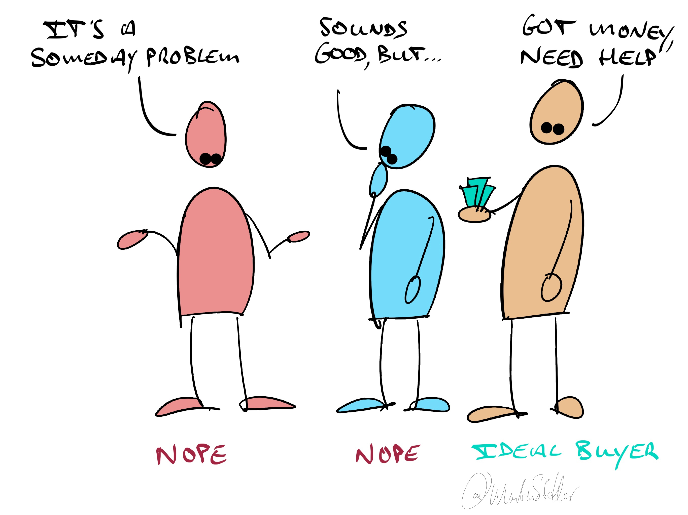

---
tags:
  - Articles
  - NeverPersuade
  - Enrollment
type: sfcContent
cdate: 2023-07-21 Fri
pubDate: 2024-02-15
---

A while ago, someone asked:

“What should I do to encourage people to buy from me?”

The good news is:

You [[📄 Never convince, never persuade|don’t need to do any encouraging]], or convincing, or persuading.

The bad news:

If you feel that you need to convince or encourage a buyer, you’ve not done your homework yet.

With ‘homework’ being:

Finding out exactly who is the kind of buyer who is ready, right now, and has the budget to get your coaching or consulting solution - so that you can ignore everyone else.

Sure, you can try and engage with people who need education on why buying is a good idea, and you can make compelling arguments, or layer on bonuses, or give discounts.

But why would you?

Doesn’t it make far more sense to figure out the perfect, ready-right-now buyer, and only talk to those people?

Because those people exist.

There are companies and individuals who are waiting for someone exactly like you to show up, who will enroll themselves, and who’ll volunteer the sale.

“Take my money” is not just a meme - it's a thing people actually say.

But, not everyone: only those who are the right match, who have the budget and who have the urgency - only those are the ones who enroll themselves, voluntarily. 

So instead of trying to convince or encourage people who aren't ideal, focus on the highly qualified buyers who just need the clarity required to make a decision, and help them make that decision.

Everyone else is either a bad fit (ignore those candidates) or they are a not-now prospect, in which case you stay in touch until the time is right for them.

Time is precious, so figure out who is [[👨‍🎓 SIBG Pt. 1.1 - How to define your customer avatar| the right prospect]], and spend your time on them.

Which leads us back to the Sales for Nice People training that I'm promoting*:

It teaches you ways of communicating with your buyer, and methods of inquiry and exploration, that make it very quick and easy to assess whether this person you're talking to is the right one at the right time.

Which is a skill you want, because you'll end up disqualifying deals faster, and putting others to sleep to keep for later, and that means you'll have fewer deals in total at any given time... but far more of those will be active, without you getting ghosted by your buyer.

So to learn that SFNP methodology and get more out of your buyer interactions, click the link below, check out the details of the programme, and schedule a call with me to discuss joining the programme.

https://martinstellar.com/leap-ethical-selling-framework/

Cheers,

Martin

P.s. For the moment it's $1500 for 10 weeks of personal training, but that will go up to $3000 in the near future.