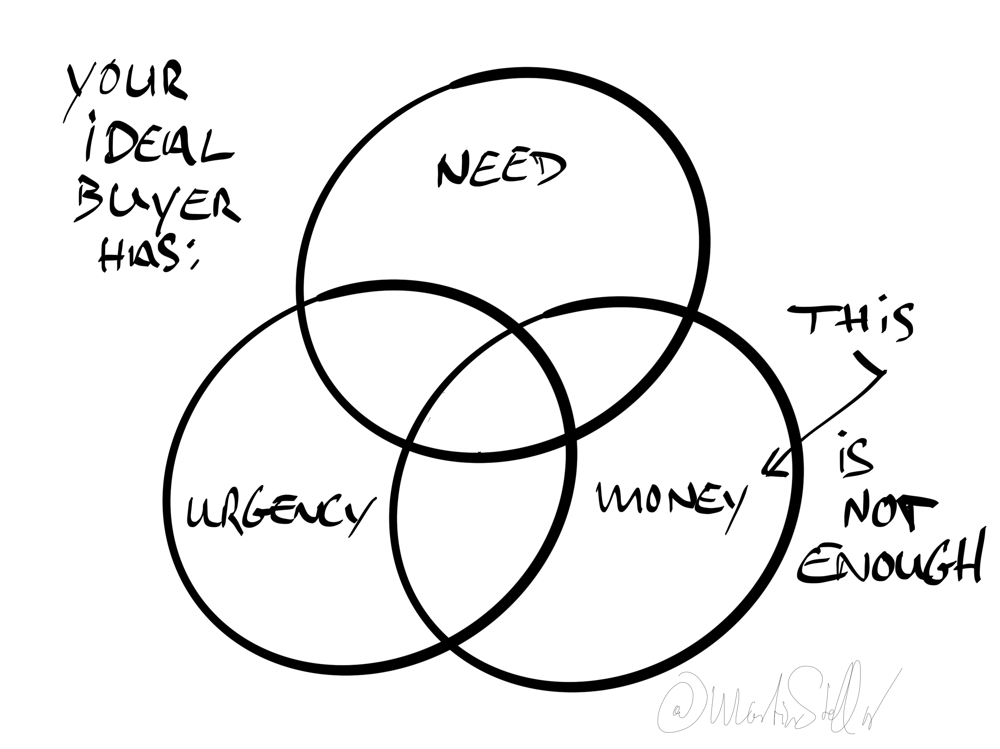

A couple of years ago, I was talking to an entrepreneur - and obviously, one of my first questions was:

“Who is your ideal buyer?”

Took him a good full minute, thinking back to the people that bought from him, and the people that he knows, and the people that he would like to buy from him.

But in the end, the only answer he had was:

“Anybody with money”.

And yeah, that’s the wrong answer.

You cannot sell to "anybody with money".

If you want people to buy your work, whether you're a coach or a consultant, or a speaker or trainer or a provider of goods, you want to look for the kind of person who needs what you do; wants what you do, and wants it now.

Because these are the people who are most likely to buy from you - provided that they also have the money, of course.

So when you look at your marketing efforts, and you look at opportunities for sales that you have, and the conversations that you engage in, are you asking yourself these questions?

- Do these people need what I do?

- Do they want what I do?

- Do they want it right now?

- Do they have the money for it?

If you don't ask yourself those questions, you are churning away incredible amounts of energy and resources, because you're targeting people who are just not qualified, not likely to enroll with you.

So if you want the whole sales process to get easier, and if you want to get a higher return from the work that you do from all the time and resources that you spend, look for the people who are the most likely candidate.

Meaning, to recap:

Those who need your thing, want your thing, want it now, and who have the money to invest.

If your buyer doesn't check those boxes, you're not looking at a buyer, and following or having meetings with them is nothing more than wasted time.

Disqualify those who aren't in the right position to buy, and focus on the actual buyers, the ones you do stand a chance with.

That's how your pipeline work and your sales efforts go from frustrating to [[📄 How to make selling easier by looking at your buyer's perspective|fun and effective]].
