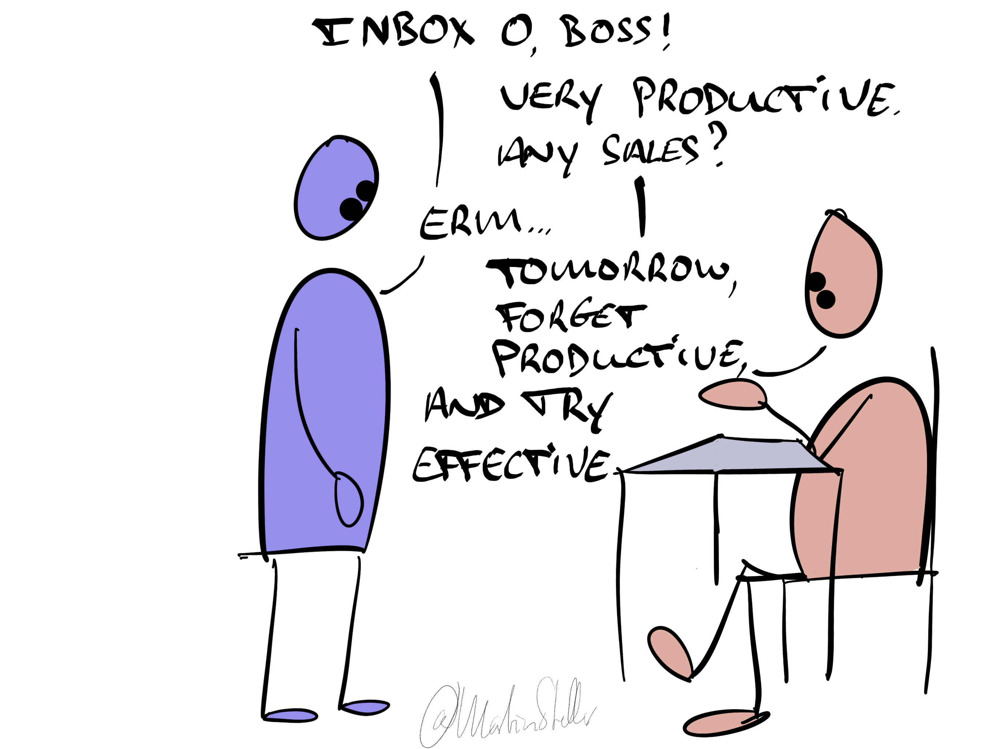

---
tags:
  - Articles
  - Mini-training
  - GrowthDrivingActivities
  - GDAs
  - Growth
  - Efficient-VS-Effective
  - Productivity
cdate: "2023-03-20 Mon"
pubDate: 2023-03-20
---

>[[🏋️ Trainings]] >> Effective Activity, Pt. 0.0

Productivity - the ability to push forward and take action - matters a lot, of course.

But the problem is that in our always-on hustle-bro culture, we easily end up being productive for the wrong reasons, and doing the wrong things.

Sure, it feels great to power through your emails and get to inbox zero. You even get to yell about your achievement on social media. Whoohoo.

But if your inbox isn't filled with buyer-conversations, and your goal is to sign more clients, you've just spent an hour being productive on something that makes no material difference to the growth of your sales.

No, the real meat & potatoes of growing your business, is being *effective* first, before trying to be productive.

Which means: choosing to act on those activiteis that most drive growth.

But then you run into a problem, because there's always a bunch of stuff we need to do, urgently, before we get to those really important growth-driving activities.

Which is how almost every entrepreneur stifles their own results, by always procrastinating on the really important work.

So to help you with that and get you to focus - and execute on - the activities that most make a difference, I'm creating a little mini-training.

Starting today, I invite you to participate in a little challenge, which is:

To clear yourself of activities that don't truly advance your business (or that might even damage its growth), and commit radical focus on those activities that do.

So, the first thing to do, is to start creating a little log of all the different kinds of activities you engage in during the day.

Because if you've ever walked into your home and you don't quite remember what you actually got done that day, you are like all of us:

We do tons of things, but we don't really have clarity on where our time goes, which makes it really easy to keep doing stuff that's too inconsequential.

So, step one is to start mapping out where your activities actually go.

[Hit this link](https://docs.google.com/spreadsheets/d/1zCtbRJwp-IgrKPuYWiw5yrcLCcOblgcBjyr37_t2qSg), create a copy of the spreadsheet for yourself (file/make a copy), and keep it open in a tab.

As you go through the next few days, keep listing in column A the different kinds of activities you engage in. Note that this column A is not meant to be a daily record of activities - it's a list of *the different types or kinds*.

Make sure you use verbs, and be as concise as possible.

Each day as you add activities for yourself, I'll be giving you a new column to add, with a specific question to help you rank your different activities. (that's why you see checkboxes)

Some example activities:

- Answering emails
- Clearing out junk email
- Faffing around on socials
- Making cold calls
- Sharpening pencils
- Organising files
- Feeding the office hamster

As you go along freely add your activities, and don't think about it too much - that's what the next few days will help you with.

Tomorrow we're going to continue with column B, and look at your [[📄 What you working on? (Zone of Genius)|Zone of Genius]].

Meanwhile, [here's the link to the ranker sheet](https://docs.google.com/spreadsheets/d/1zCtbRJwp-IgrKPuYWiw5yrcLCcOblgcBjyr37_t2qSg/) - best is to keep it open in a pinned tab for quick access as you go through your day.
